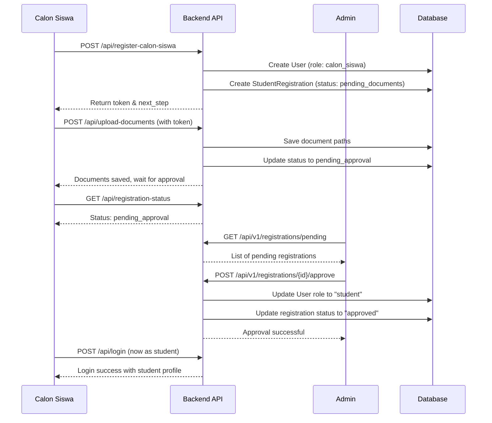

# 🔐 Authentication & Registration Flow - SmartDev LMS

## 📋 Table of Contents
- [Overview](#overview)
- [Authentication Flow](#authentication-flow)
- [Registration Flow](#registration-flow)
- [User Roles](#user-roles)
- [API Endpoints](#api-endpoints)
- [Security Best Practices](#security-best-practices)

---

## 🎯 Overview

SmartDev LMS menggunakan **single unified login endpoint** untuk semua role, dengan **role-specific registration** untuk security dan user experience yang lebih baik.

### Design Principles

✅ **Single Login Endpoint** - Satu endpoint `/api/login` untuk semua user roles  
✅ **Role-based Registration** - Registration method berbeda per role  
✅ **Secure by Default** - Admin/Instructor tidak bisa self-register  
✅ **Token-based Auth** - Laravel Sanctum untuk API authentication  

---

## 🔐 Authentication Flow

### 1. Login (Universal - All Roles)

**Endpoint:** `POST /api/login`  
**Access:** Public  
**Description:** Single endpoint untuk login semua role (student, instructor, parent, admin)

#### Request Body
```json
{
  "email": "user@example.com",
  "password": "password123"
}
```

#### Success Response (200)
```json
{
  "user": {
    "id": 1,
    "name": "John Doe",
    "email": "john@example.com",
    "role": "student",
    "phone": "081234567890",
    "profile_photo_path": "profile-photos/xyz.jpg"
  },
  "profile": {
    "id": 1,
    "user_id": 1,
    "student_number": "2024001",
    "full_name": "John Doe",
    "current_grade": "10",
    "status": "active",
    "parent": {
      "id": 1,
      "name": "Jane Doe",
      "phone": "081234567899"
    }
  },
  "access_token": "1|abc123xyz789...",
  "token_type": "Bearer"
}
```

#### Error Response (422)
```json
{
  "message": "Password yang diberikan salah"
}
```

#### Profile Loading by Role

| Role | Profile Includes |
|------|-----------------|
| **student** | `student` with `parent` relation |
| **instructor** | `instructor` with `courses` relation |
| **parent** | `parentProfile` with `students` relation |
| **admin** | `null` (no specific profile) |

#### Frontend Implementation Example
```javascript
// Login request
const response = await fetch('/api/login', {
  method: 'POST',
  headers: { 'Content-Type': 'application/json' },
  body: JSON.stringify({ email, password })
});

const data = await response.json();

// Store token
localStorage.setItem('token', data.access_token);

// Role-based redirect
switch(data.user.role) {
  case 'student':
    navigate('/student/dashboard');
    break;
  case 'instructor':
    navigate('/instructor/dashboard');
    break;
  case 'parent':
    navigate('/parent/dashboard');
    break;
  case 'admin':
    navigate('/admin/dashboard');
    break;
}
```

### 2. Logout

**Endpoint:** `POST /api/logout`  
**Access:** Protected (auth:sanctum)  
**Description:** Revoke semua tokens user yang sedang login

#### Headers
```
Authorization: Bearer {token}
```

#### Success Response (200)
```json
{
  "message": "Successfully logged out"
}
```

### 3. Get Current User

**Endpoint:** `GET /api/user`  
**Access:** Protected (auth:sanctum)  
**Description:** Mendapatkan data user yang sedang login

#### Headers
```
Authorization: Bearer {token}
```

#### Response (200)
```json
{
  "id": 1,
  "name": "John Doe",
  "email": "john@example.com",
  "role": "student",
  "phone": "081234567890",
  "created_at": "2024-01-15T10:00:00.000000Z"
}
```

---

## 📝 Registration Flow

### Role-Based Registration Strategy

| Role | Registration Method | Endpoint | Access Level |
|------|-------------------|----------|--------------|
| **Calon Siswa** | Self-registration (public) | `POST /api/register-calon-siswa` | Public |
| **Student** | Approved by admin | Auto-created after approval | - |
| **Instructor** | Created by admin | `POST /api/v1/instructors` | Admin only |
| **Parent** | Created by admin | `POST /api/v1/parents` | Admin only |
| **Admin** | Created by super admin | `POST /api/v1/users` | Admin only |

### 1. Student Registration (2-Step Process)

#### Step 1: Basic Registration

**Endpoint:** `POST /api/register-calon-siswa`  
**Access:** Public  
**Description:** Calon siswa register dengan data dasar

##### Request Body
```json
{
  "name": "John Doe",
  "email": "john@example.com",
  "password": "password123",
  "password_confirmation": "password123",
  "phone": "081234567890",
  "tanggal_lahir": "2005-05-15",
  "tempat_lahir": "Jakarta",
  "jenis_kelamin": "L",
  "nama_orang_tua": "Jane Doe",
  "phone_orang_tua": "081234567899",
  "alamat_orang_tua": "Jl. Contoh No. 123, Jakarta"
}
```

##### Success Response (200)
```json
{
  "success": true,
  "message": "Registration successful",
  "user": {
    "id": 1,
    "name": "John Doe",
    "email": "john@example.com",
    "role": "calon_siswa",
    "student_registration": {
      "id": 1,
      "registration_status": "pending_documents"
    }
  },
  "next_step": "upload_documents"
}
```

#### Step 2: Upload Documents

**Endpoint:** `POST /api/upload-documents`  
**Access:** Protected (auth:sanctum, role:calon_siswa)  
**Description:** Upload dokumen pendaftaran

##### Headers
```
Authorization: Bearer {token}
Content-Type: multipart/form-data
```

##### Request Body (Form Data)
```
ktp_orang_tua: [File] (jpg/png, max 2MB)
ijazah: [File] (jpg/png/pdf, max 2MB)
foto_siswa: [File] (jpg/png, max 1MB)
bukti_pembayaran: [File] (jpg/png/pdf, max 2MB)
```

##### Success Response (200)
```json
{
  "message": "Documents uploaded successfully. Your registration is now pending admin approval.",
  "user": {
    "id": 1,
    "name": "John Doe",
    "role": "calon_siswa"
  },
  "registration": {
    "id": 1,
    "registration_status": "pending_approval",
    "submitted_at": "2024-01-15T10:00:00.000000Z"
  },
  "documents": {
    "ktp_orang_tua_url": "http://localhost/storage/registration_documents/1_ktp_orang_tua_123456.jpg",
    "ijazah_url": "http://localhost/storage/registration_documents/1_ijazah_123456.jpg",
    "foto_siswa_url": "http://localhost/storage/registration_documents/1_foto_siswa_123456.jpg",
    "bukti_pembayaran_url": "http://localhost/storage/registration_documents/1_bukti_pembayaran_123456.jpg"
  },
  "next_step": "wait_for_approval"
}
```

#### Step 3: Check Registration Status

**Endpoint:** `GET /api/registration-status`  
**Access:** Protected (auth:sanctum, role:calon_siswa)

##### Response (200)
```json
{
  "user": {
    "id": 1,
    "name": "John Doe",
    "role": "calon_siswa"
  },
  "registration": {
    "id": 1,
    "registration_status": "pending_approval",
    "submitted_at": "2024-01-15T10:00:00.000000Z",
    "approved_at": null,
    "approval_notes": null
  },
  "registration_status": "pending_approval",
  "documents": {
    "ktp_orang_tua_url": "http://localhost/storage/...",
    "ijazah_url": "http://localhost/storage/...",
    "foto_siswa_url": "http://localhost/storage/...",
    "bukti_pembayaran_url": "http://localhost/storage/..."
  },
  "is_complete": true,
  "next_step": "wait_for_approval"
}
```

### 2. Admin Approval Process

#### Get Pending Registrations

**Endpoint:** `GET /api/v1/registrations/pending`  
**Access:** Protected (admin only)

##### Response (200)
```json
{
  "data": [
    {
      "id": 1,
      "user": {
        "id": 1,
        "name": "John Doe",
        "email": "john@example.com",
        "role": "calon_siswa"
      },
      "registration_status": "pending_approval",
      "submitted_at": "2024-01-15T10:00:00.000000Z",
      "tanggal_lahir": "2005-05-15",
      "tempat_lahir": "Jakarta",
      "nama_orang_tua": "Jane Doe",
      "phone_orang_tua": "081234567899",
      "documents": {
        "ktp_orang_tua_url": "...",
        "ijazah_url": "...",
        "foto_siswa_url": "...",
        "bukti_pembayaran_url": "..."
      },
      "is_complete": true
    }
  ],
  "count": 1
}
```

#### Approve Registration

**Endpoint:** `POST /api/v1/registrations/{userId}/approve`  
**Access:** Protected (admin only)

##### Request Body (Optional)
```json
{
  "approval_notes": "Dokumen lengkap dan valid"
}
```

##### Success Response (200)
```json
{
  "message": "Registration approved successfully",
  "data": {
    "user": {
      "id": 1,
      "name": "John Doe",
      "role": "student"
    },
    "registration": {
      "registration_status": "approved",
      "approved_at": "2024-01-15T11:00:00.000000Z",
      "approved_by": 2
    }
  }
}
```

#### Reject Registration

**Endpoint:** `POST /api/v1/registrations/{userId}/reject`  
**Access:** Protected (admin only)

##### Request Body (Required)
```json
{
  "rejection_reason": "Dokumen ijazah tidak jelas, mohon upload ulang"
}
```

##### Success Response (200)
```json
{
  "message": "Registration rejected successfully",
  "data": {
    "user": {
      "id": 1,
      "role": "calon_siswa"
    },
    "registration": {
      "registration_status": "rejected",
      "approval_notes": "Dokumen ijazah tidak jelas, mohon upload ulang",
      "approved_by": 2,
      "approved_at": "2024-01-15T11:00:00.000000Z"
    }
  }
}
```

### 3. Instructor Creation (Admin Only)

**Endpoint:** `POST /api/v1/instructors`  
**Access:** Protected (admin only)

#### Request Body
```json
{
  "name": "Prof. Smith",
  "email": "smith@example.com",
  "password": "securepassword123",
  "phone": "081234567890",
  "specialization": "Mathematics",
  "qualifications": "PhD in Mathematics",
  "hire_date": "2024-01-01"
}
```

#### Response (201)
```json
{
  "message": "Instructor created successfully",
  "data": {
    "id": 1,
    "user_id": 5,
    "instructor_number": "INS2024001",
    "full_name": "Prof. Smith",
    "specialization": "Mathematics",
    "user": {
      "id": 5,
      "name": "Prof. Smith",
      "email": "smith@example.com",
      "role": "instructor"
    }
  }
}
```

### 4. Parent Creation (Admin Only)

**Endpoint:** `POST /api/v1/parents`  
**Access:** Protected (admin only)

#### Request Body
```json
{
  "name": "Jane Doe",
  "email": "jane@example.com",
  "password": "securepassword123",
  "phone": "081234567890",
  "address": "Jl. Contoh No. 456, Jakarta",
  "occupation": "Entrepreneur",
  "relationship": "Mother"
}
```

#### Response (201)
```json
{
  "message": "Parent created successfully",
  "data": {
    "id": 1,
    "user_id": 6,
    "full_name": "Jane Doe",
    "phone": "081234567890",
    "user": {
      "id": 6,
      "name": "Jane Doe",
      "email": "jane@example.com",
      "role": "parent"
    }
  }
}
```

---

## 👥 User Roles

### Role Hierarchy

```
Admin (Super User)
  ├── Full system access
  ├── Can create: Instructors, Parents, Admins
  └── Can approve/reject student registrations

Instructor
  ├── Create & manage courses
  ├── Upload materials & assignments
  ├── Grade students
  └── View enrolled students

Student
  ├── Enroll in courses
  ├── Access materials
  ├── Submit assignments
  └── View own grades

Parent
  ├── View children's courses
  ├── View children's grades
  ├── View children's progress
  └── Communication with instructors

Calon Siswa (Temporary)
  ├── Upload registration documents
  ├── Check registration status
  └── Converts to "Student" after approval
```

### Role-based Access Control

```php
// Middleware checks in routes
Route::middleware(['auth:sanctum', 'role:admin'])->group(...);
Route::middleware(['auth:sanctum', 'role:instructor'])->group(...);
Route::middleware(['auth:sanctum', 'role:student'])->group(...);
Route::middleware(['auth:sanctum', 'role:parent'])->group(...);
```

---

## 🔒 Security Best Practices

### 1. Password Management

**Change Password**

**Endpoint:** `POST /api/change-password`  
**Access:** Protected (auth:sanctum)

```json
{
  "current_password": "oldpassword123",
  "new_password": "newpassword456",
  "new_password_confirmation": "newpassword456"
}
```

**Forgot Password**

**Endpoint:** `POST /api/forgot-password`  
**Access:** Public

```json
{
  "email": "user@example.com"
}
```

**Reset Password**

**Endpoint:** `POST /api/reset-password`  
**Access:** Public

```json
{
  "email": "user@example.com",
  "token": "reset_token_from_email",
  "password": "newpassword123",
  "password_confirmation": "newpassword123"
}
```

### 2. Token Management

- **Token Rotation**: Old tokens are revoked on new login
- **Token Scope**: `auth_token` for general access
- **Token Expiration**: Configure in `sanctum.php`
- **Token Storage**: Client-side in secure storage (localStorage/sessionStorage)

### 3. Authorization Layers

1. **Route-level**: Middleware checks role
2. **Controller-level**: Policy authorization
3. **Model-level**: Query scopes based on user

### 4. Input Validation

All inputs are validated with Laravel validation rules:
- Email format validation
- Password strength (min 8 characters)
- File type and size validation
- SQL injection prevention (Eloquent ORM)
- XSS prevention (auto-escaped in Blade)

### 5. File Upload Security

- **Allowed types**: jpg, png, pdf only
- **Max size**: 2MB (documents), 1MB (photos)
- **Storage**: Outside public directory
- **Access**: Through authenticated URLs
- **Naming**: Randomized to prevent guessing

---

## 📊 Registration Status Flow

```
pending_documents
    ↓ (upload documents)
pending_approval
    ↓ (admin action)
    ├→ approved → role changes to "student"
    └→ rejected → stays as "calon_siswa"
```

### Status Definitions

| Status | Description | User Can |
|--------|-------------|----------|
| `pending_documents` | Waiting for document upload | Upload documents |
| `pending_approval` | Waiting for admin review | Check status only |
| `approved` | Registration approved | Full student access |
| `rejected` | Registration rejected | Re-upload documents |

---

## 🔄 Complete Registration Workflow



---

## 📱 Frontend Integration Examples

### React/Next.js Example

```javascript
// hooks/useAuth.js
export function useAuth() {
  const login = async (email, password) => {
    const res = await fetch('/api/login', {
      method: 'POST',
      headers: { 'Content-Type': 'application/json' },
      body: JSON.stringify({ email, password })
    });
    
    const data = await res.json();
    localStorage.setItem('token', data.access_token);
    localStorage.setItem('user', JSON.stringify(data.user));
    
    return data;
  };

  const logout = async () => {
    const token = localStorage.getItem('token');
    await fetch('/api/logout', {
      method: 'POST',
      headers: { 
        'Authorization': `Bearer ${token}`
      }
    });
    
    localStorage.removeItem('token');
    localStorage.removeItem('user');
  };

  return { login, logout };
}

// components/ProtectedRoute.jsx
export function ProtectedRoute({ children, allowedRoles }) {
  const user = JSON.parse(localStorage.getItem('user'));
  
  if (!user || !allowedRoles.includes(user.role)) {
    return <Navigate to="/login" />;
  }
  
  return children;
}

// Usage
<ProtectedRoute allowedRoles={['admin', 'instructor']}>
  <Dashboard />
</ProtectedRoute>
```

---

## 📚 Additional Resources

- [Laravel Sanctum Documentation](https://laravel.com/docs/sanctum)
- [API Testing with Postman](./POSTMAN-COLLECTION.md)
- [Error Codes Reference](./ERROR-CODES.md)
- [Rate Limiting](./RATE-LIMITING.md)

---

## 🎯 Summary

### Key Takeaways

✅ **Single Login** for all roles - simplifies frontend  
✅ **Role-based Registration** - secure by design  
✅ **2-Step Student Registration** - with admin approval  
✅ **Admin-only Creation** for instructors/parents  
✅ **Token-based Auth** with Laravel Sanctum  
✅ **Clear Status Flow** for registrations  

### Quick Reference

| Action | Endpoint | Access |
|--------|----------|--------|
| Login (all roles) | `POST /api/login` | Public |
| Register student | `POST /api/register-calon-siswa` | Public |
| Upload documents | `POST /api/upload-documents` | Calon Siswa |
| Check status | `GET /api/registration-status` | Calon Siswa |
| Create instructor | `POST /api/v1/instructors` | Admin |
| Create parent | `POST /api/v1/parents` | Admin |
| Approve registration | `POST /api/v1/registrations/{id}/approve` | Admin |

---

**Last Updated:** January 2025  
**Version:** 1.0  
**API Version:** v1